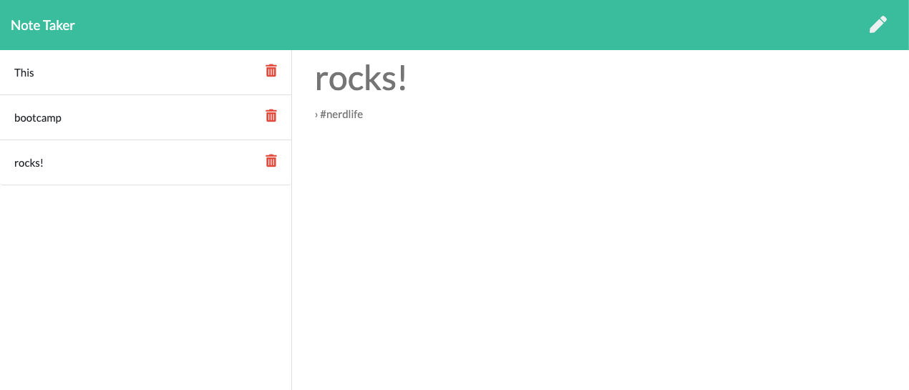

# Note Taker

## Description
This is an application that can be used to write, save, and delete notes (data from a JSON file), using an express backend.

The application allows users to ...
1. create and save notes
2. view previously saved notes
3. delete previously saved notes

## Table of Contents
* [Usage](#usage)
* [License](#license)
* [Contributing](#contributing)
* [Tests](#tests)
* [Questions](#questions)

## Usage
The deployed application can be found on [Heroku](https://cs-note-taker.herokuapp.com/).

## License
This application is covered under the **GPL v3.0** license. Permissions of this strong copyleft license are conditioned on making available complete source code of licensed works and modifications, which include larger works using a licensed work, under the same license. Copyright and license notices must be preserved. Contributors provide an express grant of patent rights.

## Contributing
Please refer to the [Contributor Covenant](https://www.contributor-covenant.org/version/2/0/code_of_conduct/).

## Tests
There are no tests for this app.

## Questions
Please direct any questions regarding this application to the developer @[HumbleKind](https://github.com/HumbleKind) (GitHub), or via email at christian_sinai@me.com.